# AirBnB clone - Web static: 🌐

# Table of Contents

1. [Task Images](#Task-Images)
2. [Check using **W3C-Validator**](#Check-using-W3C-Validator)

## Task Images

### - Task: 0 : 2

  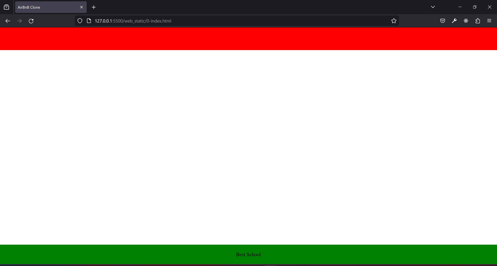

### - Task: 3

  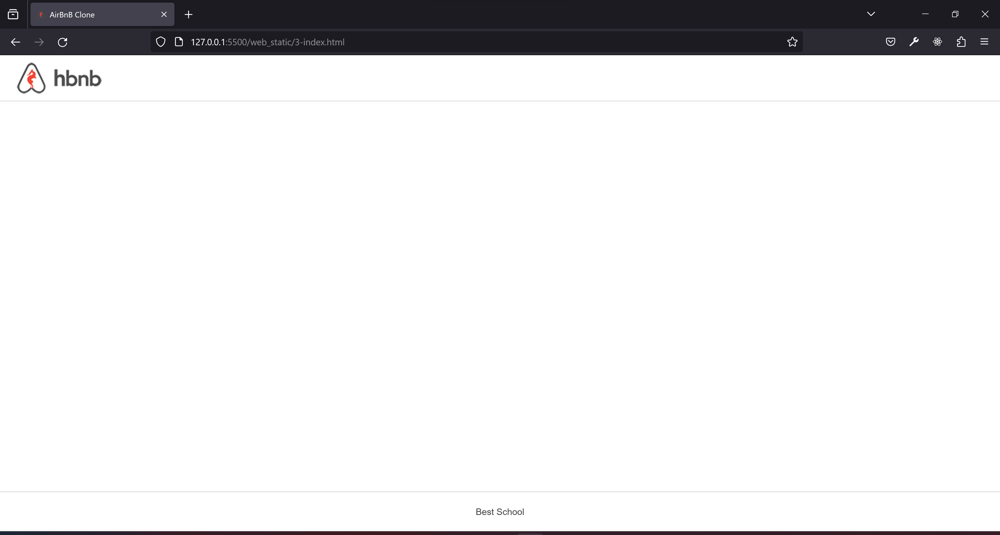

### - Task 4:

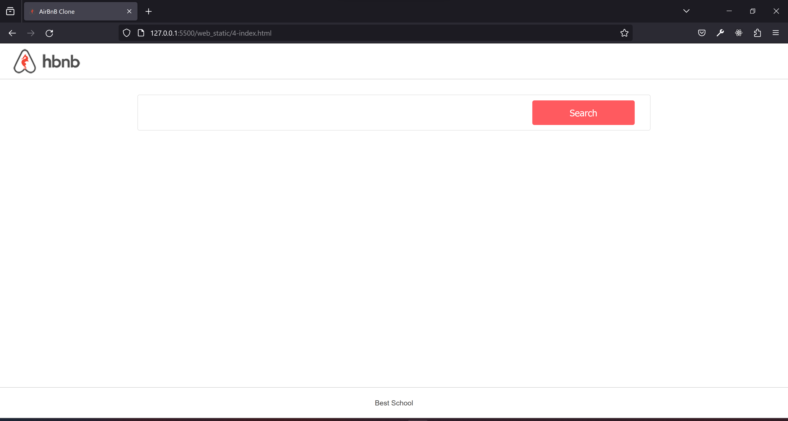

### - Task 5:

### - Task 6:

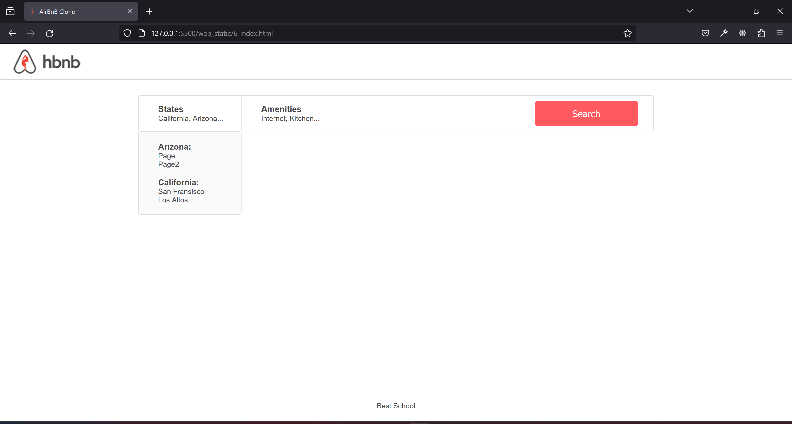
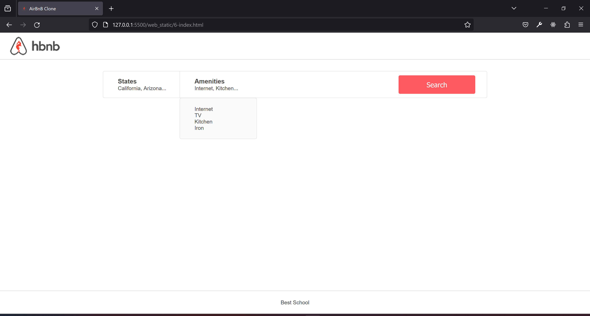

### - Task 7:

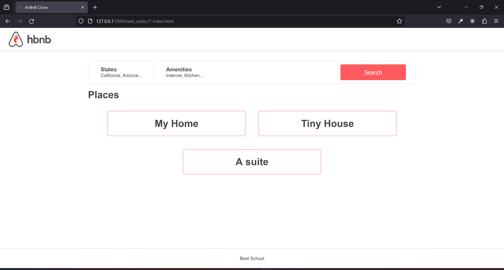

### - Task 8:

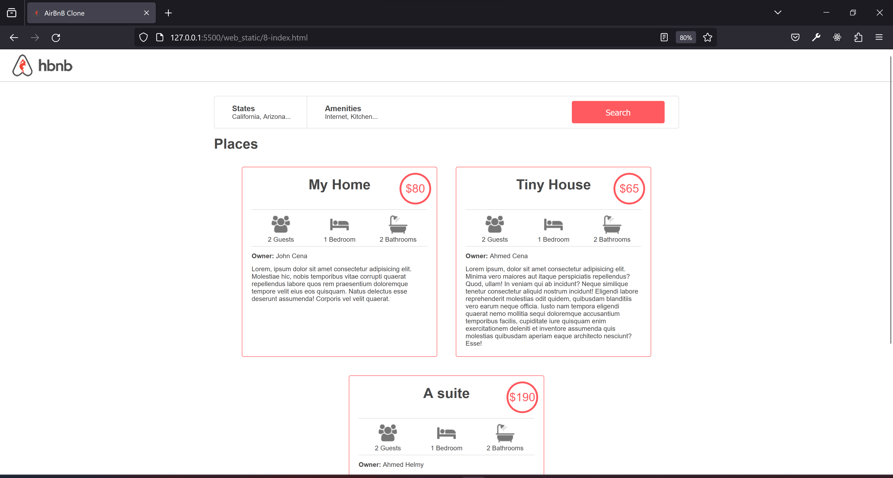

### - Task 9:

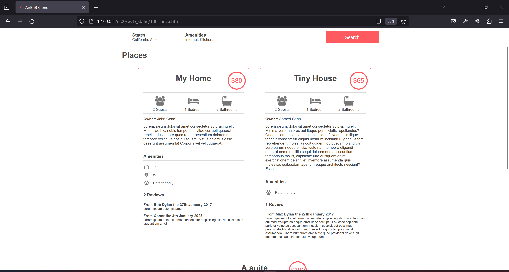

### - Task 10:

#### Before Berakpoint (min-width) `flex-wrap: wrap;`

#### After Berakpoint (min-width) `flex-wrap: wrap;`

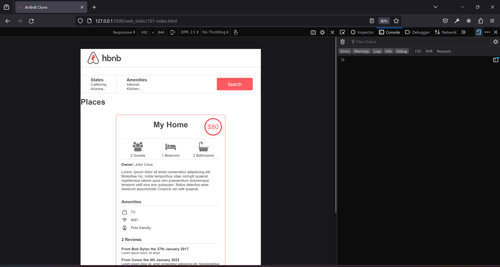

### - Task 11:

#### Responsive: Mobile version

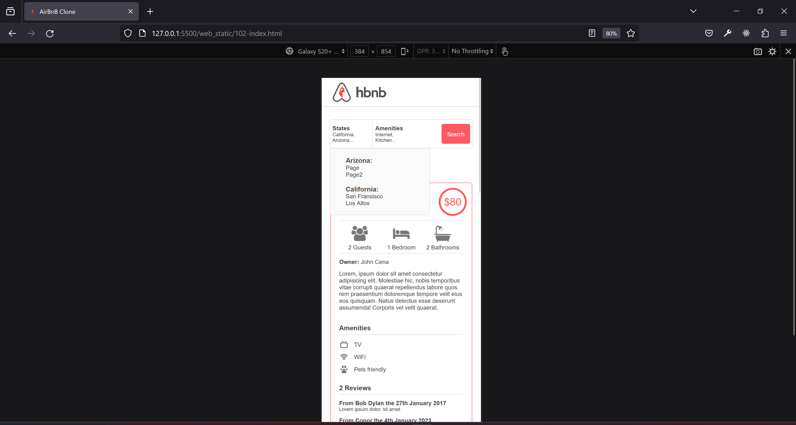
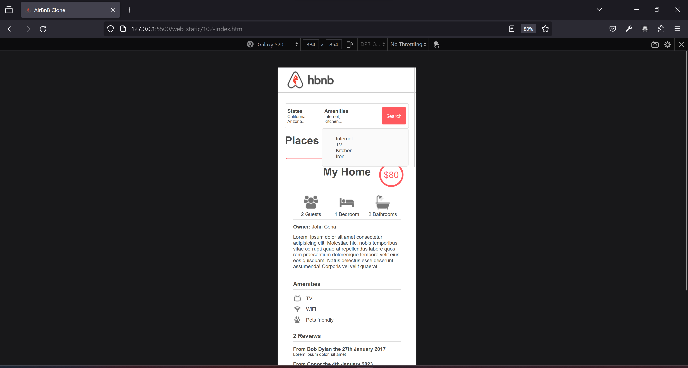

#### Responsive: Tablet version

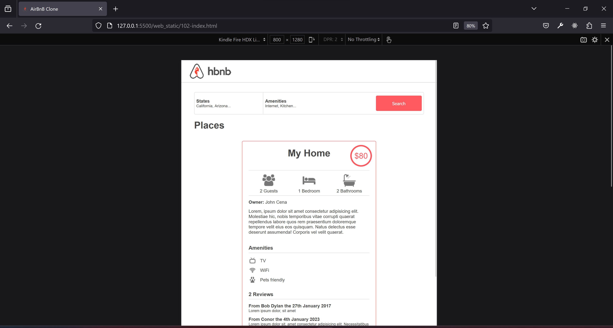

### - Task 12:

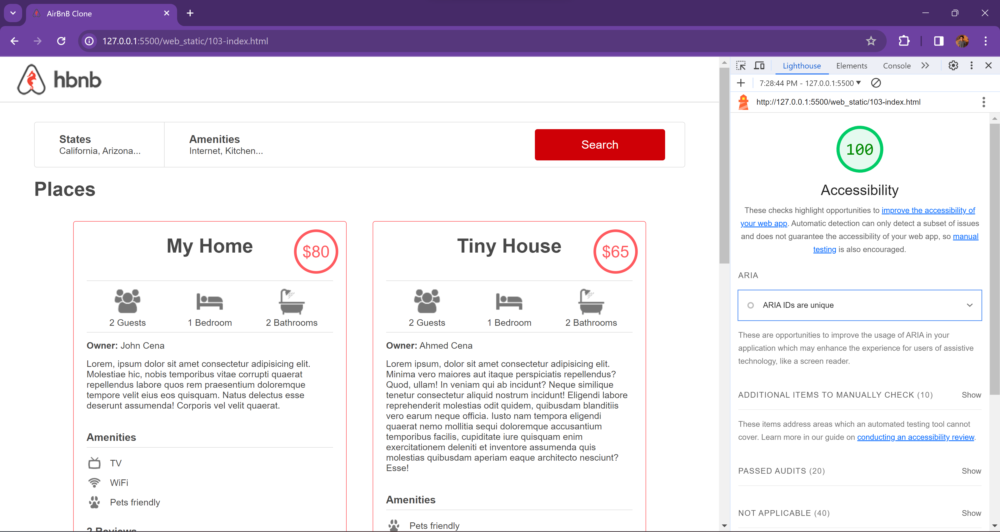

## Check using **W3C-Validator**

### - CSS Checks

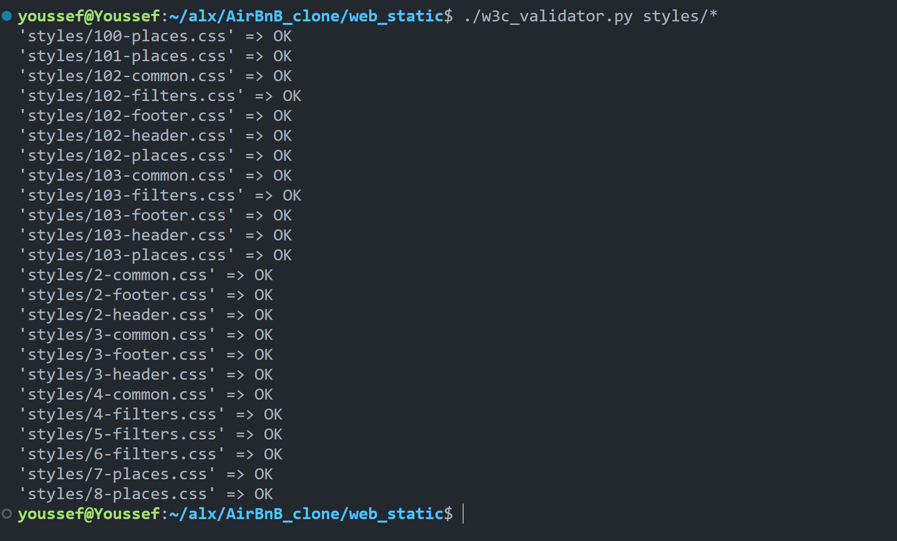

### - HTML Checks

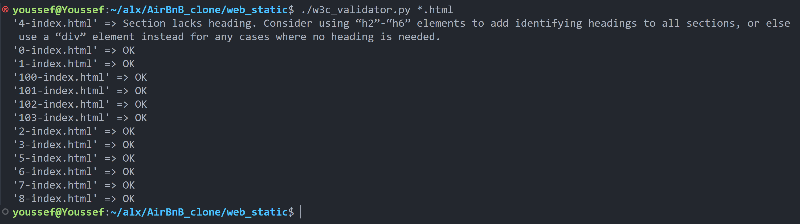

> **_NOTE 1 :_** [According to task4] 4-index.html won’t be W3C valid, don’t worry, it’s temporary
> 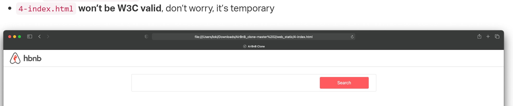
